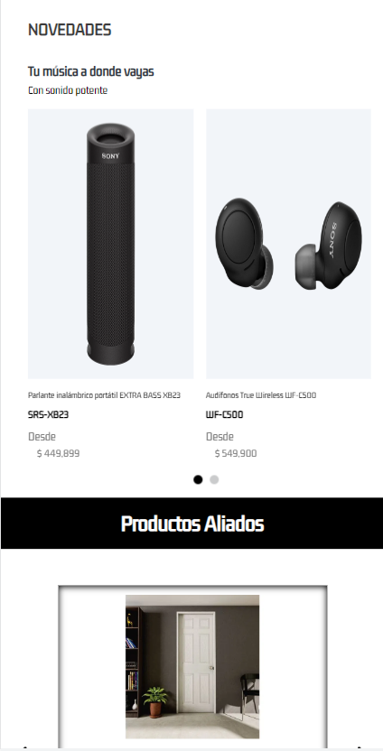
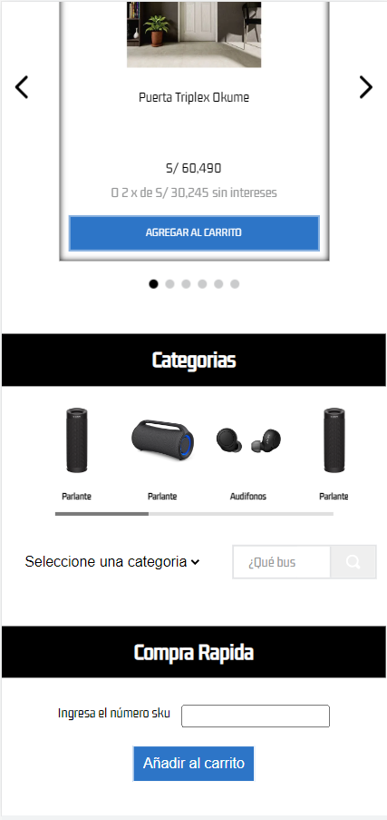
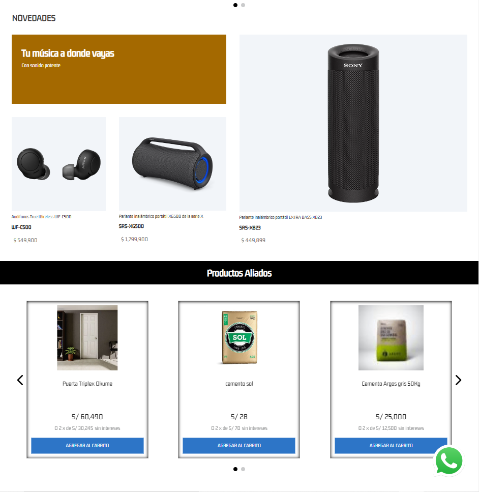
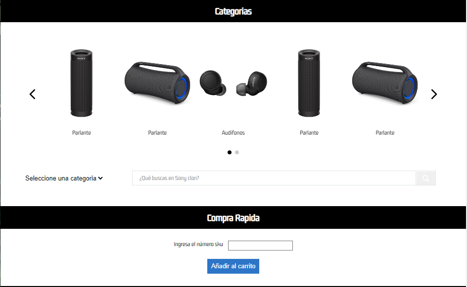
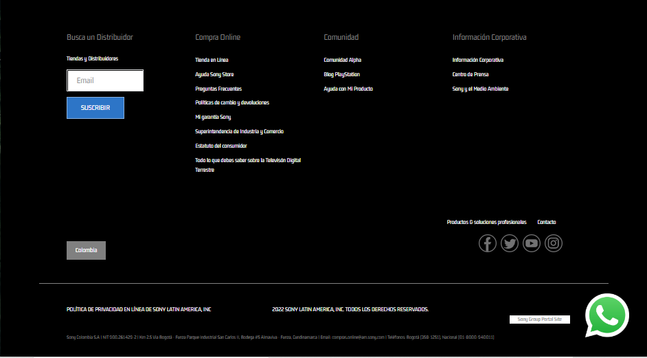
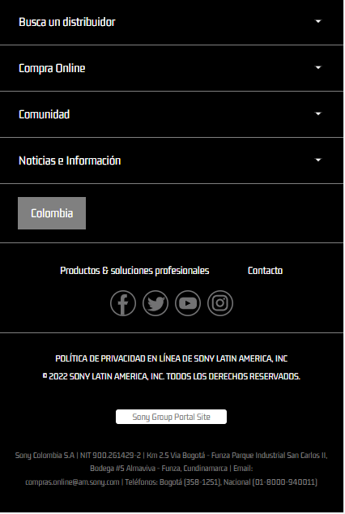

# vtex-clone-sony

- Bienvenid@ a la Tienda Sony, una réplica meticulosamente elaborada de la tienda en línea oficial de Sony Colombia. Este proyecto ha sido desarrollado utilizando VTEX IO. of sony.com.co
- Sony Store is a model clone of sony.com.co store, made with VTEX IO and custom components.
**HEADER MOBILE**


**HEADER DESKTOP**


**HOME MOBILE**






**HOME DESKTOP**






**FOOTER DESKTOP**



**FOOTER MOBILE**



## Configuration
### Step 1 - Basic setup

You must have VTEX installed on your terminal. To install it, follow the steps below.

Enter the VTEX IO documentation [basic setup guide](https://vtex.io/docs/getting-started/build-stores-with-store-framework/1) and follow all the steps.

At the end of the setup, you should have the VTEX command line interface (Toolbelt) installed along with a developer workspace in which you can work.

### Step 2 - Cloning the vtex-clone-sony repository

Clone this [repository](https://github.com/jhonortizgomez/vtex-clone-sony.git) on your computer.

### Step 3 - Edit the file `Manifest.json`

Once we're in the file, you'll need to replace the values for `vendor` and `name`. `vendor` is the name of the account we are working on and `name` is whatever you want to name your theme. For example:

```json
{
  "vendor": "vtexvendor",
  "name": "my-test-theme"
}
```

### Step 4 - Installing required apps

To use the Store Framework and work on your store theme, you need to have `vtex.store-sitemap` and `vtex.store` installed.

Run `vtex list` and check if those apps are already installed.

If not, run the following command to install them: `vtex install vtex.store-sitemap vtex.store -f`

.
### Step 5 - Uninstall any existing theme.
.

By running `vtex list`, you can check if there are any themes installed.

It is common to have a `vtex.store-theme` already installed when you start the store front development process.

So if you find it in the application list, copy its name and use it together with the `vtex uninstall` command. For example:

```json
vtex uninstall vtex.store-theme
```

### Step 6 - Launch and preview your store

Then the time has come to upload all the changes you made to your local files to the platform. For that, use the `vtex link` command.

If the process runs without errors, the following message will be displayed: `App linked successfully`. Next, run the `vtex browse` command to open a browser window with your linked store.

This will allow you to see the changes applied in real time, across the account and workspace you're working in.

## Dependencies

  1.  "vtex.store": "2.x",
  2.  "vtex.store-header": "2.x",
  3.  "vtex.product-summary": "2.x",
  4.  "vtex.store-footer": "2.x",
  5.  "vtex.store-components": "3.x",
  6.  "vtex.styleguide": "9.x",
  7.  "vtex.slider": "0.x",
  8.  "vtex.carousel": "2.x",
  9.  "vtex.shelf": "1.x",
  10.  "vtex.menu": "2.x",
  11.  "vtex.minicart": "2.x",
  12.  "vtex.product-details": "1.x",
  13.  "vtex.product-kit": "1.x",
  14.  "vtex.search-result": "3.x",
  15.  "vtex.login": "2.x",
  16.  "vtex.my-account": "1.x",
  17.  "vtex.flex-layout": "0.x",
  18.  "vtex.rich-text": "0.x",
  19.  "vtex.store-drawer": "0.x",
  20.  "vtex.locale-switcher": "0.x",
  21.  "vtex.product-quantity": "1.x",
  22.  "vtex.product-identifier": "0.x",
  23.  "vtex.product-specification-badges": "0.x",
  24.  "vtex.product-review-interfaces": "1.x",
  25.  "vtex.telemarketing": "2.x",
  26.  "vtex.order-placed": "2.x",
  27.  "vtex.stack-layout": "0.x",
  28.  "vtex.tab-layout": "0.x",
  29.  "vtex.responsive-layout": "0.x",
  30.  "vtex.slider-layout": "0.x",
  31.  "vtex.iframe": "0.x",
  32.  "vtex.breadcrumb": "1.x",
  33.  "vtex.sticky-layout": "0.x",
  34.  "vtex.add-to-cart-button": "0.x",
  35.  "vtex.modal-layout": "0.x",
  36.  "vtex.search": "2.x",
  37.  "vtex.store-icons": "0.x",
  38.  "vtex.store-image": "0.x",
  39.  "vtex.store-link": "0.x",
  40.  "vtex.product-list": "0.x",
  41.  "vtex.store-newsletter": "1.x",
  42.  "vtex.product-price": "1.x",
  43.  "vtex.disclosure-layout": "1.x"

## peerDependencies

  1.  "vtex.wish-list": "1.x",
  2.  "vtex.reviews-and-ratings": "3.x",
  3.  "vtex.questions-and-answers": "0.x",

### Custom Apps (Custom components that must be installed with the store)

  1. "itgloberspartnercl.whatsapp-button": "0.x",
  2. "itgloberspartnercl.bullets-diagramation": "0.x",
  3. "itgloberspartnercl.add-to-cart-info": "0.x",
  4. "itgloberspartnercl.custom-deparment-search": "0.x",
  5. "itgloberspartnercl.pdf-reader": "0.x",
  6. "itgloberspartnercl.quick-order": "0.x",
  7. "itgloberspartnercl.special-diagramation": "0.x"

### Contributors

  1. Jhon Ortiz Gómez
